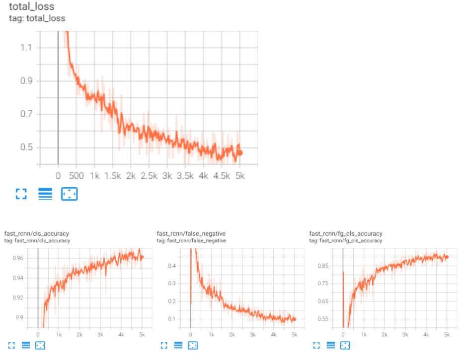
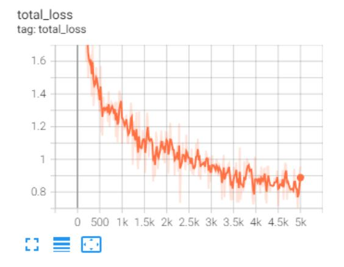
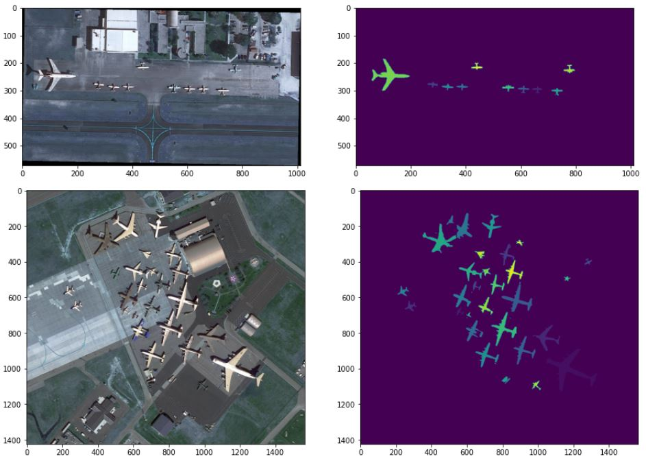
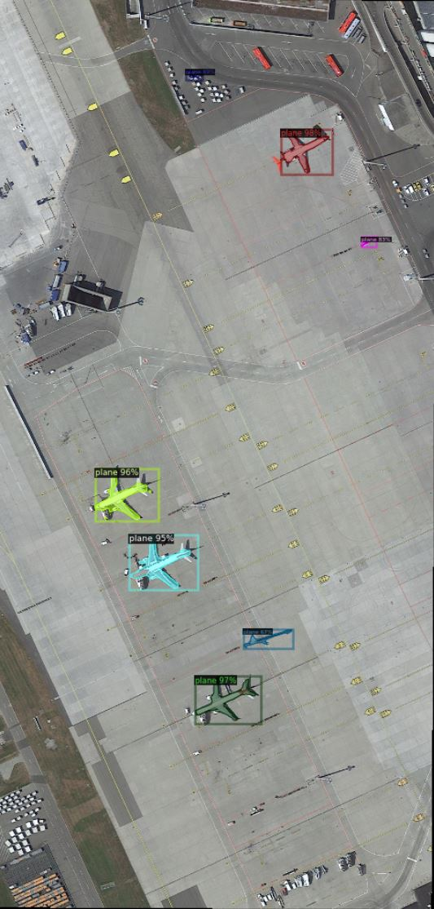
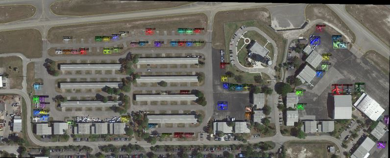

# RCNN Satelite Airplane Segmentation

The goal of this project is to build a instance segmentation model that is able to detect and segment airplanes from the satelite images from the airporst around the world. The model will consist of 3 components detection, semantic segmentation and instance segmentation component. Detection components will be responsible for determining the bounding boxes of plane objects that are located on the image. Semantic segmentation component is responsible for predicting segmentation mask that highlights the pixels of the plane. Instance segmentation component is responsible for ensuring unique segmentation for each plane on the image. 

## Dataset

To simplify the process of data collection I used the portion of the iSAID dataset that consists of 655,451 object instances for 15 categories across 2,806 high-resolution images. I have modified the standard dataset to create our own, which consists of 198 training images and 72 test images with just 1 category (Plain). I wrote a data loader ”get_detection_data” This function processes the given dataset, links each image with the corresponding annotation from the "train.json" file and returns a python list of dictionaries that contains image file details and annotations. After getting the dictionaries from the function, I registered the data and metadata in the DatasetCatalog.
   
The given images are in very high resolutions. It is not a good idea to directly use these images, because planes would appear very small in the input that is passed to our ConvNet. So one way is to divide an image into smaller blocks, then pass each
image block to ConvNet for training. Given a block, we need to look at the ground-truth bounding box information and keep only those that are inside the block. This means that at test time, given a high resolution image, I had to divide image into blocks, and pass each block to ConvNet then merge resultant bounding boxes into the same file by some coordinate transformation. 

## Detection Framework: Detectrone2
Implementing a powerful object detection model from scratch is very time consuming process. To simplify this process I decided to use [Detectron2](https://github.com/facebookresearch/detectron2) which is powered by PyTorch. There is a large collection of baseline models trained with detectron2 which can be found in [Detectron2 Model Zoo](https://github.com/facebookresearch/detectron2/blob/main/MODEL_ZOO.md). For my use cases I decided to go with "faster_rcnn_X_101_32x8d_FPN_3x". After the model finished training, the default the average precision for the range of IoU of IoU 0.5 : 0.95 was 23, which is not great. My model was not able to accurately detect all the airplanes, which is not surprising based on
the performance. To improve performance, I did the following:

1. For hyper parameter tuning I changed the base learning rate to 0.002 and number of iterations to 5000
2. I also changed my object detection method/model from ““faster_rcnn_R_101_FPN_3x.yml” to “faster_rcnn_X_101_32x8d_FPN_3x.yaml”
3. I also did a data augmentation by implementing a custom mapper and a custom trainer for the model. Custom mapper is using transforms that randomly changes contrast, brightness, saturation, rotation and lighting of the image.

These changes have allowed me to gain a significant performance improvement over my original model. Final average precision for the range of IoU of IoU 0.5 : 0.95 became 89. We can have a look how model performed by evaluating the tensorboard charts below.

As we can see from the visualization images below, results speak for themselves. 

## Semantic Segmentation
The goal of this component is to implement and train a deep neural network for image segmentation
task. I have implemented an Encoder to encode the features of the image and a Decoder to generate the new imagev(segmentation mask in here) from the encoded features. In this regard, my class consists of 3 different modules: conv, down, and up respectively as the conv layer, conv
layer with max-pooling and conv layer with upsampling. To optimize the performance I utilized UNet convolutional network architecture, which is known for fast and precise segmentation of images. This decision has yielded a IoU value of 0.84. To optimize the performance even further, I decided to use transfer learning on the downsampling portion of the segmentation model. For this I decided to go with to gothe resnet18, which improved the IoU value to 0.91. 

Using this model structure, the training was done using Binary Cross Entropy Loss with logits and ADAM optimizer. Here is are the sample images and their predicted segmentation mask.

## Instance Segmentation

Once both the detection and the segmentation modules were implemented, I utilized both components to implement the instance segmentation results for the dataset. Custom instance segmentation component will utilize the detection model that we previously trained and semantic segmentation model that we trained after that that. Instance segmentation model is responsible for uniqely segmenting each plane on the image. Since both segmentation and detection components were highly optimized its no surprise that instance segmentation component also had a high accuracy. The model performance can be evaluated from the tensorboard chart below

The visualization of the model is illustrated below.

## Mask R-CNN

To make sure that our custom model is the best model for the task, I also implemented a Mask R-CNN. Once it has been trained we will compare the performance with the custom model that we trained earlier.

Both Instance Segmentation Model and Mask R-CNN are the extension of the Faster R-CNN. They both use Faster R-CNN to determine the bounding boxes of the objects, but where they differ is the segmentation method used and the customizability of each approach.
The drawback of the custom model is that I had to implement semantic segmentation model and detection model
separately which takes a lot of time. To optimize the custom model, I had to spend a lot of time
optimizing detection portion and then spending even more time optimizing semantic segmentation
portion. The benefit of the custom model is that we have a greater control of each component of the
model. For instance depending on our use cases we can swap out segmentation component or detection
component with different architecture to achieve better or faster results.
Then advantage of mask r-cnn is that that it is much more convenient than the method we used for the custom model. It takes very fast to implement it since most of its components have bee pre-defined. To optimize it you can simply play around with configurations or with transformations by implementing a custom trainer. The
drawback of mask r-cnn is that it is not as customizable as the custom model. We can’t easily swap out
individual components of the model with our own implementation if them. Both Fast r-cnn model in the detection component and mask r-cnn are pretrained models. However, Just by examining the detection portion of the models, we can see that our fast r-cnn in the custom model has greater AP50 value of 94.46
where mask r-cnn has AP50 of 89.53 for the IoU range of 0.5 - 0.95. This means that our detection
component of the custom model is able to detect objects better than the detection component of mask r-cnn. This is because the configuration for the detection model focused on only training and optimizing model for
detection purposes which is why it yields better results for that particular task where mask r-cnn model
is focused on optimizing the performance of segmentation and detection as one unit, which is why
detection component yields lower average precision AP50 score. As for when we compare the segmentation component of mask r-cnn and instance segmentations component of the custom model. Just examining visualization portion of both models we can see that they perform very similar. All the airplanes were segmented with similar precision. This is not surprising because we spentsignificant amount of time tuning semantic segmentation component of the custom model and the configuration that we used
for mask r-cnn was intended to optimize the detection task for fast r-cnn. 